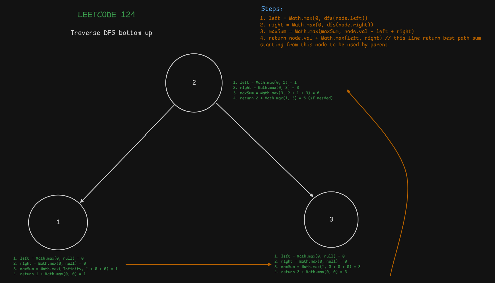

# LeetCode Problem Note

## 1. LeetCode Information

- **Title:** [Binary Tree Maximum Path Sum](https://leetcode.com/problems/binary-tree-maximum-path-sum)
- **Difficulty:**
  - [ ] 🟢 Easy
  - [ ] 🟡 Medium
  - [x] 🔴 Hard
- **Tags:** #btree #dfs

## 2. Code Idea

- Using DFS recursion.
- Get the max value in each node left/right
- Use a variable to store the `maxSum`, it should be the max value of the current path through the node (`left + right + node.val`).
- In each recursion, return the max value that help to identify which is the best path to the parent from the current node, since the parent can only choose 1 path (left or right).

## 3. Key Steps (Pseudo Code at High Level)

- Step 1:
  ```js
  let maxSum = -Infinity;
  ```
- Step 2:

  ```js
  function dfs(node) {
    if (!node) return 0;

    let left = Math.max(0, dfs(node.left));
    let right = Math.max(0, dfs(node.right));

    maxSum = Math.max(maxSum, node.val + left + right);

    return node.val + Math.max(left, right);
  }
  ```

- Step 3:

  ```js
  dfs(root);
  return maxSum;
  ```

## 4. Related Patterns/Algorithms (Check all that apply)

- [ ] Array
- [ ] String
- [ ] Hash Table / Map
- [ ] Stack
- [ ] Queue
- [ ] Linked List
- [x] Tree / Binary Tree
- [ ] Binary Search Tree
- [ ] Heap / Priority Queue
- [x] Graph / BFS / DFS
- [ ] Sliding Window
- [ ] Two Pointers
- [ ] Divide and Conquer
- [x] Dynamic Programming
- [ ] Greedy
- [ ] Backtracking
- [ ] Bit Manipulation
- [ ] Trie
- [ ] Union Find / Disjoint Set
- [ ] Topological Sort
- [ ] Math
- [x] Recursion
- [ ] Other:

## 5. Time & Space Complexity

- **Time Complexity:** `O(n)`
  - `n` the total nodes of the tree
- **Space Complexity:** `O(h)`
  - `h` the height of the tree


